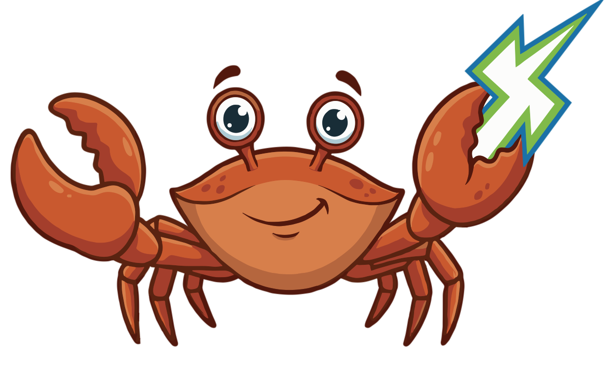

## RustCFML



A CFML (ColdFusion&reg; Markup Language) Interpreter written in Rust.

ColdFusion is a registered trademark of Adobe Inc. This project is not affiliated with or endorsed by Adobe.


## Usage

**[Try RustCFML in your browser](https://pixl8.github.io/RustCFML/demo/)** — interactive demo running on WebAssembly.

RustCFML requires Rust stable (>= 1.75.0). If you don't currently have Rust  
installed you can do so by following the instructions at  
[rustup.rs](https://rustup.rs/).

To check your Rust version, run `rustc --version`. To update,  
run `rustup update stable`.

### Building from Source

Clone the repository and build:

```plaintext
git clone https://github.com/pixl8/RustCFML.git
cd RustCFML
cargo build --release
```

### Running CFML Files

```plaintext
# Run a .cfm file
cargo run --release -- myapp.cfm

# Run a .cfc component file
cargo run --release -- MyComponent.cfc
```

### Running Inline Code

```plaintext
cargo run -- -c 'writeOutput("Hello, World!");'
```

```plaintext
Hello, World!
```

### Interactive Shell (REPL)

```plaintext
$ cargo run -- -r
RustCFML REPL v0.1.0
Type 'exit' or 'quit' to exit

cfml&gt; writeOutput("Hello")
Hello
cfml&gt; var x = 2 + 2
cfml&gt; writeOutput(x)
4
cfml&gt; exit
```

### Web Server Mode

Serve `.cfm` files over HTTP with built-in CGI, URL, Form, Cookie, Session, Request, and Application scopes:

```plaintext
# Serve the current directory on port 8500 (default)
cargo run --release -- --serve

# Serve a specific directory on a custom port
cargo run --release -- --serve examples/miniapp --port 3000

# Use single-threaded mode for lower memory usage
cargo run --release -- --serve --single-threaded
```

```plaintext
RustCFML server running on http://127.0.0.1:3000 (multi-threaded)
Document root: /path/to/examples/miniapp
Press Ctrl+C to stop
```

The server is built on [Axum](https://github.com/tokio-rs/axum) and handles concurrent requests. It serves `.cfm` files and static assets from the document root. Directory requests serve `index.cfm` if present (`/` → `index.cfm`, `/admin/` → `admin/index.cfm`). Path info routing is supported (`/index.cfm/users/123` resolves to `index.cfm` with path info `/users/123`). CFML web scopes are injected so pages can read request data:

```javascript
// URL params: /?name=World
writeOutput(url.name);              // World

// Request info
writeOutput(cgi.request_method);    // GET
writeOutput(cgi.path_info);         // /about
writeOutput(cgi.query_string);      // name=World

// POST form data
writeOutput(form.username);

// Cookie scope (from request headers)
writeOutput(cookie.CFID);

// Session scope (server-side, per-user via CFID cookie)
session.username = "Alex";

// Application scope (persists across requests)
application.hitCount = (application.hitCount ?: 0) + 1;

// Request scope (per-request, shared across includes)
request.startTime = getTickCount();
```

#### URL Rewriting

Place a `urlrewrite.xml` file in your document root for Tuckey-compatible URL rewriting. This enables clean URLs and REST-style routing:

```xml
<?xml version="1.0" encoding="utf-8"?>
<urlrewrite>
    <rule>
        <from>^/([a-zA-Z][a-zA-Z0-9_/-]*)$</from>
        <to>/index.cfm/$1</to>
    </rule>
    <rule>
        <from>^/old-page$</from>
        <to type="permanent-redirect">/new-page</to>
    </rule>
</urlrewrite>
```

Supported features:
- **Regex and wildcard patterns** with backreference substitution (`$1`, `$2`)
- **Forward**, **redirect** (302), and **permanent-redirect** (301) actions
- **Conditions** on HTTP method, port, and headers
- **Rule chaining** with `last="true"` to stop processing

#### Application.cfc Lifecycle

If an `Application.cfc` file exists in the document root (or any parent directory), it is automatically loaded and its lifecycle methods are called:

- `onApplicationStart()` — runs once when the application is first accessed
- `onRequestStart(targetPage)` — runs before each request
- `onRequest(targetPage)` — handles the request (replaces default page execution)
- `onRequestEnd(targetPage)` — runs after each request
- `onError(exception, eventName)` — handles uncaught errors

Application state (`application` scope) persists across requests in serve mode. Component mappings defined via `this.mappings` in Application.cfc are supported for virtual path resolution.

### Installing Globally

```plaintext
cargo install --path crates/cli
rustcfml examples/01_hello.cfm
```

### Shell Scripts (Shebang Support)

RustCFML scripts can be executed directly as shell scripts using a shebang line. The file extension does not matter.

```bash
#!/usr/bin/env rustcfml
writeOutput("Hello from a shell script!" & chr(10));
var x = 2 + 2;
writeOutput("2 + 2 = " & x & chr(10));
```

```plaintext
chmod +x myscript.cfm
./myscript.cfm
```

## Performance

Benchmarked serving a simple "Hello World" `.cfm` page using Apache Bench (`ab -n 100 -c 1`). Each server was warmed up before measuring. Memory is peak RSS from `ps`.

| Metric | RustCFML | Lucee 7.0.1 | BoxLang 1.10 |
|---|---|---|---|
| **Memory (RSS)** | **~8 MB** | ~350 MB | ~305 MB |
| **Requests/sec** | **1,949 req/s** | 635 req/s | 293 req/s |
| **Avg response time** | **0.5 ms** | 1.6 ms | 3.4 ms |
| **Startup** | instant | ~15s | ~15s |

RustCFML compiles to a native binary with no runtime VM overhead, resulting in significantly lower memory usage and faster response times compared to JVM-based CFML engines.

## Examples

RustCFML supports both **CFScript** (script syntax) and **CFML Tags** (HTML-like syntax).

### CFScript

```javascript
// Variables and types
var name = "RustCFML";
var version = 1.0;
var items = [1, 2, 3, 4, 5];
var person = {name: "Alex", age: 30};

// String member functions
writeOutput("hello world".ucase());          // HELLO WORLD
writeOutput("  padded  ".trim());             // padded
writeOutput("hello".reverse());               // olleh

// Array operations
var doubled = items.map(function(n) {
    return n * 2;
});
writeOutput(doubled.toList());                // 2,4,6,8,10

var evens = items.filter(function(n) {
    return n % 2 == 0;
});
writeOutput(evens.toList());                  // 2,4

var total = items.reduce(function(acc, n) {
    return acc + n;
}, 0);
writeOutput(total);                           // 15

// Struct member functions
writeOutput(person.keyList());                // age,name
writeOutput(person.count());                  // 2

// User-defined functions
function fibonacci(n) {
    if (n &lt;= 1) return n;
    return fibonacci(n - 1) + fibonacci(n - 2);
}
writeOutput(fibonacci(10));                   // 55

// String interpolation (double-quoted strings)
var greeting = "Hello #name#!";               // Hello RustCFML!
writeOutput("2 + 2 = #2 + 2#");              // 2 + 2 = 4

// Elvis operator &amp; null-safe navigation
var config = settings?.database?.host ?: "localhost";
var fallback = nullValue ?: "default";

// Regex
var pos = reFind("\d+", "abc123");            // 4
var cleaned = reReplace("abc123", "\d+", ""); // abc
var nums = reMatch("\d+", "a1b2c3");          // [1, 2, 3]

// For-in with structs
for (var key in person) {
    writeOutput("#key#: #person[key]#");
}

// CFML keyword operators
writeOutput(5 GT 3);                          // true
writeOutput("hello" CONTAINS "ell");          // true
writeOutput(true AND false);                  // false

// File I/O
fileWrite("/tmp/hello.txt", "Hello!");
var content = fileRead("/tmp/hello.txt");     // Hello!
writeOutput(fileExists("/tmp/hello.txt"));    // true

// Components with inheritance
component Animal {
    function init(name) {
        this.name = name;
        return this;
    }
    function speak() {
        return this.name &amp; " makes a sound";
    }
}
component Dog extends Animal {
    function speak() {
        return this.name &amp; " says Woof!";
    }
}
var dog = new Dog("Rex");
writeOutput(dog.speak());                     // Rex says Woof!
writeOutput(isInstanceOf(dog, "Animal"));     // true

// Error handling
try {
    throw("Something went wrong");
} catch (any e) {
    writeOutput("Caught: " &amp; e);
}
```

### CFML Tags

```html
<cfset name="World">
<cfoutput>Hello, #name#!</cfoutput>

<cfset score="85">
<cfif score="" gte="" 90="">
    <cfoutput>Grade: A</cfoutput>
<cfelseif score="" gte="" 80="">
    <cfoutput>Grade: B</cfoutput>
<cfelse>
    <cfoutput>Grade: F</cfoutput>
</cfelse></cfelseif></cfif>

<cfloop from="1" to="5" index="i">
    <cfoutput>#i# </cfoutput>
</cfloop>

<cffunction name="greet" access="public">
    <cfargument name="who" default="World">
    <cfreturn "hello,="" "="" &="" arguments.who="">
</cfreturn></cfargument></cffunction>

<cfoutput>#greet("CFML")#</cfoutput>

<cfscript>
    // Mix tag and script syntax freely
    writeOutput("Script inside tags!");
</cfscript>
```

### More Examples

See the [`examples/`](examples/) directory:

```plaintext
cargo run -- examples/01_hello.cfm           # Hello World
cargo run -- examples/02_variables.cfm        # Variables and arithmetic
cargo run -- examples/03_conditionals.cfm     # If/else
cargo run -- examples/04_arrays.cfm           # Arrays
cargo run -- examples/05_ternary.cfm          # Nested conditionals
cargo run -- examples/06_expressions.cfm      # Parenthesised expressions
cargo run -- examples/07_booleans.cfm         # Boolean logic
cargo run -- examples/08_builtins.cfm         # Built-in functions
```

## Features

### Implemented

*   **Full CFScript parser** with proper operator precedence
*   **CFML Tag preprocessor** — automatic tag-to-script conversion
*   **Stack-based bytecode VM** for execution
*   **390+ built-in functions** across strings, arrays, structs, math, dates, lists, JSON, queries, file I/O, conversion, type checking, caching, and security
*   **Member functions** — `"hello".ucase()`, `[1,2,3].len()`, `{a:1}.keyList()`
*   **Higher-order functions** — `arrayMap`, `arrayFilter`, `arrayReduce`, `arraySome`, `arrayEvery`, `structEach`, `structReduce`, `listMap`, `listFilter`, etc. with closure support
*   **Method chaining** — `"hello world".ucase().reverse()`
*   **CFML keyword operators** — `GT`, `LT`, `EQ`, `NEQ`, `CONTAINS`, `AND`, `OR`, `NOT`, `MOD`, `EQV`, `IMP`
*   **Control flow** — `for`, `for-in`, `while`, `do/while`, `switch/case`, `break`, `continue`
*   **For-in with structs** — `for (var key in myStruct)` iterates over struct keys
*   **Functions** — user-defined, closures, arrow functions, recursion
*   **Error handling** — `try/catch/finally`, `throw`
*   **Data types** — null, boolean, integer, double, string, array (1-based), struct (case-insensitive), function, query
*   **String interpolation** — `"Hello #name#!"` with expression support in double-quoted strings
*   **Elvis operator** — `value ?: "default"` null coalescing
*   **Null-safe navigation** — `obj?.prop?.nested` returns null instead of erroring
*   **Regex support** — `reFind()`, `reReplace()`, `reMatch()` + case-insensitive variants via `regex` crate
*   **File I/O** — `fileRead()`, `fileWrite()`, `fileExists()`, `directoryList()`, `getFileInfo()`, and more
*   **Hashing** — `hash()` with MD5, SHA-1, SHA-256, SHA-384, SHA-512 support
*   **Include** — `include "file.cfm"` executes in current scope
*   **Components** — `component Name { }` with `init()` constructor, `this` scope, and method calls
*   **Component inheritance** — `extends` with dot-path resolution, `super.method()` calls, `isInstanceOf()`, `createObject()`
*   **Component metadata** — `getMetadata()` returns name, extends, functions, properties, and custom `@annotations`
*   **Implicit property accessors** — `getXxx()`/`setXxx()` auto-generated for component properties
*   **onMissingMethod** — fallback handler for undefined method calls on components
*   **Application.cfc lifecycle** — `onApplicationStart`, `onRequestStart`, `onRequest`, `onRequestEnd`, `onError`
*   **Scopes** — `local`, `variables`, `arguments`, `request` (per-request), `application` (persistent), `server` (read-only), `session` (server-side via CFID cookie), `cookie` (from request headers)
*   **Component mappings** — virtual path resolution via `this.mappings` in Application.cfc
*   **50+ CFML tags** — `<cfset>`, `<cfoutput>`, `<cfif>`, `<cfloop>`, `<cffunction>`, `<cfscript>`, `<cftry>/<cfcatch>/<cffinally>`, `<cfthrow>/<cfrethrow>`, `<cfswitch>/<cfcase>`, `<cfbreak>`, `<cfcontinue>`, `<cfwhile>`, `<cfinclude>`, `<cfdump>`, `<cfparam>`, `<cfabort>`, `<cfhttp>/<cfhttpparam>`, `<cfquery>/<cfqueryparam>`, `<cftransaction>`, `<cflocation>`, `<cfheader>`, `<cfcontent>`, `<cfinvoke>`, `<cfsavecontent>`, `<cflock>`, `<cfsilent>`, `<cflog>`, `<cfsetting>`, `<cfcookie>`, `<cffile>`, `<cfloginuser>/<cflogout>`, `<cfmail>/<cfmailparam>/<cfmailpart>`, `<cfcache>`, `<cfexecute>`, `<cfstoredproc>/<cfprocparam>/<cfprocresult>`, and more
*   **HTTP client** — `cfhttp` tag and function for GET/POST/PUT/DELETE/PATCH requests with `cfhttpparam` support (headers, formfields, URL params, body, cookies)
*   **Database connectivity** — `queryExecute()` with SQLite, MySQL, PostgreSQL, and MSSQL support; connection pooling, `cfqueryparam`, `cftransaction`
*   **Session management** — server-side sessions via CFID cookie, `sessionInvalidate()`, `sessionRotate()`
*   **Authentication** — `cfloginuser`, `cflogout`, `getAuthUser()`, `isUserLoggedIn()`, `isUserInRole()`
*   **File uploads** — multipart/form-data parsing, `fileUpload()`, `fileUploadAll()`, `<cffile action="upload">`
*   **Query higher-order functions** — `queryEach`, `queryMap`, `queryFilter`, `queryReduce`, `querySort`, `querySome`, `queryEvery`
*   **Security** — `encrypt()`/`decrypt()` (AES, DES, DESEDE, Blowfish), `hmac()`, `generateSecretKey()`, Base64/Hex/UU encoding
*   **XML** — `xmlParse()`, `xmlSearch()`, `isXML()` via quick-xml
*   **Stack traces** — runtime errors include file, line, column, and full call stack
*   **Closure mutation** — closures can read and write to parent scope variables
*   **Spread operator** — `[...arr, 3]`, `{...defaults, key: value}`, `func(...args)`
*   **URL rewriting** — Tuckey-compatible `urlrewrite.xml` with regex/wildcard patterns, conditions, and redirect support
*   **Web server** — Axum-based `--serve` mode with concurrent request handling, configurable single/multi-threaded runtime
*   **WASM target** — compile to WebAssembly via `wasm-bindgen`
*   **Debug mode** — inspect tokens, AST, and bytecode with `-d`

*   **Email** — `cfmail`/`cfmailparam`/`cfmailpart` with real SMTP sending (plain text, HTML, attachments via lettre)
*   **Caching** — in-memory cache with `cachePut()`, `cacheGet()`, `cacheDelete()`, `cacheClear()`, `cacheKeyExists()`, `cacheCount()`, `cacheGetAll()`, `cacheGetAllIds()`, expiry support
*   **OS commands** — `cfexecute` with stdout/stderr capture, stdin body, variable and buffer output modes
*   **Stored procedures** — `cfstoredproc`/`cfprocparam`/`cfprocresult` compiled to `queryExecute("CALL ...")`
*   **Custom tags** — `cfmodule`, `cf_` prefix tags with body mode, caller write-back, thisTag scope
*   **Password hashing** — bcrypt, scrypt, argon2, PBKDF2
*   **Locale functions** — 13 `ls*` functions for locale-aware formatting

### Planned / In Progress

*   **Tag libraries** — `cfimport taglib=`, `.tld` descriptors
*   **Threading** — `cfthread` equivalent
*   **Higher-order generics** — `collectionEach/Map/Filter`, `stringEach/Map/Filter`, generic `each()`

## Architecture

```plaintext
CFML Source (.cfm / .cfc)
    |
    v
Tag Preprocessor ──&gt; CFScript      (tag_parser.rs)
    |
    v
Lexer ──&gt; Tokens                    (lexer.rs)
    |
    v
Parser ──&gt; AST                      (parser.rs, ast.rs)
    |
    v
Compiler ──&gt; Bytecode               (compiler.rs)
    |
    v
Virtual Machine ──&gt; Output          (vm/lib.rs)
    + Built-in Functions            (builtins.rs)
```

### Crate Structure

```plaintext
RustCFML/
├── crates/
│   ├── cfml-common/     # Shared types: CfmlValue, CfmlError, Position
│   ├── cfml-compiler/   # Lexer, Parser, AST, Tag Preprocessor
│   ├── cfml-codegen/    # Bytecode compiler (AST → BytecodeOp)
│   ├── cfml-vm/         # Stack-based bytecode execution engine
│   ├── cfml-stdlib/     # 390+ built-in functions
│   ├── cli/             # Command-line interface (rustcfml binary)
│   └── wasm/            # WebAssembly target via wasm-bindgen
├── examples/            # Example .cfm files
├── tests/               # Test suite (998 assertions across 74 suites)
├── TESTING.md           # Testing guide
└── Cargo.toml           # Workspace root
```

## Embedding RustCFML into your Rust Applications

You can use RustCFML as a library to execute CFML from within Rust:

```plaintext
use cfml_codegen::compiler::CfmlCompiler;
use cfml_compiler::parser::Parser;
use cfml_stdlib::builtins::{get_builtin_functions, get_builtins};
use cfml_vm::CfmlVirtualMachine;

fn main() {
    let source = r#"
        var name = "Rust";
        writeOutput("Hello from " &amp; name);
    "#;

    let mut parser = Parser::new(source.to_string());
    let ast = parser.parse().expect("parse failed");

    let compiler = CfmlCompiler::new();
    let program = compiler.compile(ast);

    let mut vm = CfmlVirtualMachine::new(program);

    for (name, value) in get_builtins() {
        vm.globals.insert(name, value);
    }
    for (name, func) in get_builtin_functions() {
        vm.builtins.insert(name, func);
    }

    vm.execute().expect("execution failed");
    println!("{}", vm.output_buffer);  // "Hello from Rust"
}
```

## Compiling to WebAssembly

RustCFML includes a WASM crate that exposes a `CfmlEngine` to JavaScript via `wasm-bindgen`:

```plaintext
# Install wasm-pack if you haven't
cargo install wasm-pack

# Build the WASM package
wasm-pack build crates/wasm --target web
```

Usage from JavaScript:

```javascript
import init, { CfmlEngine } from './pkg/rustcfml_wasm.js';

await init();
const engine = CfmlEngine.new();
const output = engine.execute('writeOutput("Hello from WASM!");');
console.log(output); // "Hello from WASM!"
```

> **[Try the interactive demo](https://pixl8.github.io/RustCFML/demo/)** — runs entirely
> in your browser via WebAssembly. The demo is automatically built and deployed
> via GitHub Actions on every push to `main`.

## Testing

Run the built-in CFML test suite (998 assertions across 74 suites):

```plaintext
cargo run -- tests/runner.cfm
```

Run Rust unit tests:

```plaintext
cargo test
```

Run with debug output to inspect the full pipeline:

```plaintext
cargo run -- -d -c 'var x = [1,2,3]; writeOutput(x.len());'
```

See [TESTING.md](TESTING.md) for the full testing guide, including how to add  
unit tests, integration tests, and test individual features.

## Disclaimer

RustCFML is in active development. The interpreter covers a substantial portion
of the CFML language — including 390+ built-in functions, 50+ tags, components with
inheritance, application lifecycle, sessions, database connectivity, SMTP email,
in-memory caching, closures with mutation, and file uploads — and can run real
CFScript and tag-based CFML code including frameworks like Taffy. It is not yet
production-ready.

Contributions are welcome!

## Goals

*   Full CFML environment entirely in Rust (not a Java/JVM binding)
*   Support both CFScript and CFML tag syntax
*   Clean, modular architecture following the RustPython model
*   WebAssembly support for running CFML in the browser
*   Embeddable as a library in Rust applications

## Related Projects

These are the CFML engines and reference implementations that informed this  
project:

*   [Lucee](https://github.com/lucee/Lucee) — open-source CFML engine (Java)
*   [BoxLang](https://github.com/ortus-boxlang/BoxLang) — modern CFML+ runtime (Java)
*   [RustPython](https://github.com/RustPython/RustPython) — Python interpreter in Rust (architectural reference)

## License

This project is licensed under the MIT license.